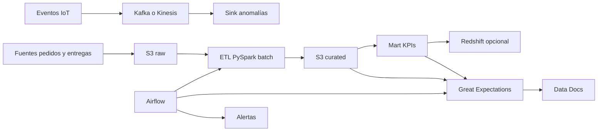

# Bases de Datos Relacionales y NoSQL

HU3: Diseño e Implementación del Modelo Relacional (PostgreSQL)

Objetivo: Modelar los datos transaccionales (Clientes, Catálogo, Pedidos, Entregas) asegurando integridad referencial.

Paso 1: Definición del Esquema (DDL)
Debes crear 4 tablas principales. Utiliza el esquema proporcionado en la página 2 y 3 del documento para definir los tipos de datos correctos:

Tabla Clientes:

Definir id_cliente como Primary Key (PK) (tipo VARCHAR).

Asegurar que el campo zona acepte los valores permitidos: Norte, Sur, Oriente, Occidente, Centro.

Asegurar que tipo_cliente acepte: Retail, Farmacéutico, Supermercado, etc..

Tabla Catalogo:

Definir id_producto como PK.

Configurar precio como FLOAT y tipo_entrega como VARCHAR (validar valores: Same Day, Next Day, etc.).

Tabla Pedidos:

Definir id_pedido como PK.

Crear Foreign Keys (FK):


id_cliente referenciando a Clientes(id_cliente).


id_producto referenciando a Catalogo(id_producto).

El campo fecha debe ser TIMESTAMP (UTC-agnóstico).

Tabla Entregas:


Nota Importante: Esta tabla solo contiene pedidos no cancelados.

Definir id_pedido como FK referenciando a Pedidos(id_pedido).

Incluir campos para logística: conductor y vehiculo.

Paso 2: Script de Creación (SQL)
Escribe un script .sql que ejecute las sentencias CREATE TABLE en el orden correcto para evitar errores de llaves foráneas:

Crear Clientes y Catalogo (Tablas maestras).

Crear Pedidos (Tabla transaccional dependiente).

Crear Entregas (Tabla dependiente de Pedidos).

Paso 3: Carga de Datos de Prueba (DML)
El documento indica que AceleraTI entrega archivos CSV (clientes.csv, pedidos.csv, etc.).

Desarrolla un script (en Python con Pandas o SQL COPY) para ingestar estos CSVs en tu base de datos local o instancia RDS de prueba.


Validación: Ejecuta un COUNT(*) en cada tabla para verificar que coincida con los volúmenes esperados (~300 clientes, ~2000 pedidos).

HU4: Diseño del Modelo NoSQL (Datos IoT)

Objetivo: Almacenar datos de alta velocidad provenientes de sensores IoT (Temperatura, Ubicación).

Paso 1: Selección del Motor y Estrategia
Dado que la plataforma es en AWS, DynamoDB es la opción nativa recomendada, aunque MongoDB también es válido.

Análisis del dato: Son series de tiempo por vehículo. Necesitas consultas rápidas por vehículo y rango de fechas.

Paso 2: Diseño de la Tabla (Ejemplo DynamoDB)
Diseña la tabla Sensores optimizada para patrones de acceso de lectura/escritura intensiva:


Partition Key (PK): id_vehiculo (Permite distribuir la carga por camión).


Sort Key (SK): timestamp (Permite ordenar eventos cronológicamente y consultar rangos de tiempo).

Atributos:

latitud (Number)

longitud (Number)

temperatura (Number)


evento (String: "OK" o "TEMP_CRITICA").

Paso 3: Carga de Datos NoSQL (Scripting)
Utiliza el archivo sensores.csv provisto (que simula 10,000 eventos).

Crea un script (Python con boto3 para DynamoDB o pymongo para MongoDB) que:

Lea el CSV fila por fila.

Convierta cada fila en un objeto JSON.

Inserte el documento en la base de datos NoSQL.

Tip: Para DynamoDB, usa BatchWriteItem para optimizar costos y velocidad.

Entregables Finales para estas HU
Según la tabla de evaluación:

Documento de Diseño (modelo_datos_logidata.pdf):

Diagrama Entidad-Relación (DER) del modelo SQL.

Diagrama o descripción JSON del modelo NoSQL.

Justificación de los tipos de datos elegidos.

Código Fuente:

Scripts SQL (schema.sql).

Scripts de carga inicial (load_data.py).


# Bodegas de datos
HU12: Diseño del Modelo Dimensional (Analista BI)
Descripción: Como analista BI, quiero diseñar un modelo dimensional para analizar el cumplimiento de entregas por zona y tiempos.

Tarea 12.1: Definición de Granularidad y Procesos de Negocio

Establecer el grano de la tabla de hechos: ¿Una fila representa una orden de envío, un ítem dentro del envío o un intento de entrega?.

Validar que el grano elegido permita responder preguntas sobre tiempos de retraso y cumplimiento por zona.

Tarea 12.2: Diseño de la Matriz de Bus (Bus Matrix)

Identificar las dimensiones conformadas (que se compartirán con otros procesos como Ventas o Inventario).

Definir la relación entre Dim_Tiempo, Dim_Zona (Geografía) y el Hecho de Entregas.

Tarea 12.3: Definición de Estrategia SCD (Slowly Changing Dimensions)

Decisión Crítica: Analizar la Dim_Zona o Dim_Cliente. Si un cliente se muda o una zona cambia de región administrativa, ¿debemos preservar la historia de sus entregas anteriores en la zona vieja?

Opción A (SCD Tipo 1): Sobrescribir. Se pierde el rastro histórico de la zona anterior.

Opción B (SCD Tipo 2): Crear una nueva fila con claves subrogadas y fechas de vigencia (Fecha_Inicio, Fecha_Fin, Activo). Esto permite reportar la entrega histórica en la zona correcta en ese momento.

Entregable: Documento de mapeo indicando qué atributos son Tipo 1 y cuáles Tipo 2.

Tarea 12.4: Clasificación de Medidas (Facts)

Definir las medidas en la Fact_Entregas:


Días de Retraso: Medida aditiva o semi-aditiva (promediable).

Cumplimiento (Flag): 1 si cumplió, 0 si no (para calcular % de éxito).

Asegurar que las fechas (Fecha Promesa vs. Fecha Real) se modelen como Role-Playing Dimensions apuntando a Dim_Tiempo.

HU13: Implementación DDL y Preparación de Datos (Ingeniero de Datos)
Descripción: Como ingeniero, quiero preparar los datos para consumo analítico (DDL y Staging).

Tarea 13.1: Creación de Claves Subrogadas (Surrogate Keys)

Diseñar la lógica para generar claves sintéticas (ej. ID_Zona_SK) en lugar de usar las claves primarias del sistema operacional (ERP), para aislar el DW de cambios en la fuente.

Tarea 13.2: Scripting DDL de Dimensiones (Esquema en Estrella)

Escribir el CREATE TABLE para Dim_Tiempo, Dim_Geografia/Zona y Dim_Transportadora.


Implementación SCD: Si en la HU12 se decidió SCD Tipo 2 para la Zona, incluir columnas de auditoría en el DDL: Row_Effective_Date, Row_Expiration_Date y Is_Current.

Desnormalizar jerarquías (País -> Región -> Zona) en una sola tabla ancha para mejorar el rendimiento de lectura (Star Schema).

Tarea 13.3: Scripting DDL de Tabla de Hechos

Crear la Fact_Entregas asegurando la integridad referencial (Foreign Keys) hacia las tablas de dimensiones creadas.

Incluir las claves de fecha para los diferentes roles (Fecha Envío, Fecha Entrega).

Tarea 13.4: Carga Inicial de Dimensiones "Dummy"

Insertar registros para manejar valores nulos o desconocidos (ej. ID -1 = "Sin Información") para mantener la integridad referencial en el modelo estrella.

Nuevas Historias de Usuario Sugeridas (Basadas en el PPT)
Para completar el ciclo de desarrollo de una Bodega de Datos robusta, te sugiero agregar estas historias:

HU14: Desarrollo de Procesos ETL/ELT para Carga de Datos
Como Ingeniero de Datos, Quiero desarrollar los pipelines de extracción y transformación, Para poblar el modelo dimensional desde las fuentes transaccionales.

Tareas:

Implementar la lógica de limpieza y normalización antes de cargar al DW.

Desarrollar la lógica de "Lookups" para resolver las Claves Subrogadas de las dimensiones durante la carga de hechos.

Manejar la carga incremental para SCD Tipo 2 (detectar cambios vs. inserciones nuevas).

HU15: Configuración de Capacidades OLAP (Cubos/Semántica)
Como Analista de Datos, Quiero configurar jerarquías de navegación y agregaciones, Para permitir a los usuarios hacer Drill-down y Roll-up en los reportes.

Tareas:

Definir la jerarquía de tiempo (Año -> Trimestre -> Mes -> Día) para permitir Roll-up automático de métricas.

Configurar la jerarquía geográfica (País -> Ciudad -> Zona) para permitir operaciones de Drill-down.

Pre-calcular agregaciones comunes (ej. Total Entregas por Mes) para optimizar tiempos de respuesta.

HU16: Optimización de Rendimiento del Modelo
Como Arquitecto de Datos, Quiero aplicar estrategias de indexación y particionamiento, Para asegurar que las consultas sobre grandes volúmenes de datos respondan en segundos.

Tareas:

Evaluar si se requiere particionamiento de la Fact_Entregas (por ejemplo, por Año/Mes).

Crear índices bitmap en las claves foráneas de las dimensiones si la cardinalidad es baja, o B-Tree si es alta.

Validar que el modelo estrella esté optimizado para reducir el número de JOINs necesarios en tiempo de consulta.

# Data Lake

HU5: Construir un Data Lake en S3 que reciba datos crudos desde distintas fuentes
1) Diseño de la estructura del Data Lake (raw y curated)

Tarea 1.1: Definir convención de nombres y layout de paths en S3

Salida: documento corto con naming + estructura.

Propuesta de layout:

s3://<lake-bucket>/raw/<source>/<dataset>/ingest_date=YYYY-MM-DD/part-*.json|csv|parquet

s3://<lake-bucket>/curated/<domain>/<dataset>/event_date=YYYY-MM-DD/part-*.parquet

s3://<lake-bucket>/quarantine/<source>/<dataset>/... (errores)

s3://<lake-bucket>/_system/metadata/... (checkpoints, manifests)

DoD: layout aprobado y documentado (incluye ejemplo real por dataset).

Tarea 1.2: Definir particionado mínimo por zona

Raw: ingest_date (siempre), opcional source_system

Curated: por fecha de evento (event_date) o year/month/day según caso

DoD: criterios de particionado escritos y aplicables por dataset.

2) Provisionamiento de S3 con seguridad y escalabilidad

Tarea 2.1: Crear bucket(s) y prefijos con controles base

Versioning (recomendado), bloqueo de acceso público, políticas de bucket.

DoD: bucket creado con “public access block” y versioning configurado.

Tarea 2.2: Cifrado y llaves

SSE-KMS para raw/curated, key policy alineada a roles de ingesta/ETL/consulta.

DoD: objetos quedan cifrados; roles autorizados pueden leer/escribir.

Tarea 2.3: Lifecycle y costos

Reglas para transición de raw a IA/Glacier según retención (ej. 30/90/365 días).

DoD: lifecycle activo y documentado con rationale de costos.

Tarea 2.4: Auditoría y logging

CloudTrail Data Events (si aplica), S3 server access logs (opcional), métricas.

DoD: trazabilidad habilitada para operaciones críticas (write/delete/list).

3) Scripts de ingesta en Python (a zona raw)

Tarea 3.1: Especificación de “contrato de ingesta” por fuente

Campos mínimos de metadata: source, dataset, ingest_ts, batch_id, schema_version.

Formatos esperados, compresión, tamaño objetivo de archivos.

DoD: contrato escrito para al menos 2 datasets piloto.

Tarea 3.2: Construir framework de ingesta (Python)

Componentes:

Cargador por fuente (conectores)

Normalizador de nombres/encoding

Escritura a S3 con layout estándar

Registro de manifest/checkpoint (para idempotencia)

DoD: repo con estructura clara (src/, configs/, tests/, README), ejecución local y parametrizable.

Tarea 3.3: Idempotencia y re-ejecución segura

Estrategia recomendada:

batch_id determinístico (por ventana/archivo)

manifest en /_system/metadata/manifests/

evitar duplicados al reintentar

DoD: re-ejecutar un batch no duplica datos (validado con prueba).

Tarea 3.4: Manejo de errores y “quarantine”

Regla: registros/archivos inválidos van a quarantine/ con motivo y timestamp.

DoD: se generan evidencias en quarantine/ + log; el pipeline no “traga” errores silenciosamente.

Tarea 3.5: Logging y métricas operativas

Logs estructurados (JSON), conteos: leídos, escritos, rechazados, duración.

DoD: logs consumibles por CloudWatch y con correlación por batch_id.

Tarea 3.6: Conectores iniciales (mínimo 2 fuentes)

Ejemplos típicos: SFTP/FTPS, API REST, BD (RDS), archivos locales, Salesforce, SAP (según contexto).

DoD: cada conector tiene config, prueba y ejemplo de ejecución.

4) Orquestación mínima (para escalar y operar)

Tarea 4.1: Definir modo de ejecución

Opciones: cron en container, AWS Lambda, AWS Glue Python Shell, ECS, Step Functions.

DoD: decisión tomada y documentada con pros/contras.

Tarea 4.2: Scheduler y reintentos

Política de reintento, backoff, alertas en fallas repetidas.

DoD: existe ejecución programada y se puede forzar un run manual.

HU6: Catalogar la información en AWS Glue para habilitar consultas gobernadas
1) Modelado de catálogo (Glue Databases y Tables)

Tarea 1.1: Definir bases de datos Glue por zona y dominio

Ejemplo: dl_raw, dl_curated, o por dominio curated_finance, curated_collections.

DoD: naming y criterio definidos y aplicados a piloto.

Tarea 1.2: Definir “table standards”

Ubicación S3, formato (ideal: Parquet en curated), particiones, owners.

DoD: plantilla de definición de tabla lista (campos, particiones, parámetros).

2) Población del Glue Catalog

Tarea 2.1: Crear Glue Crawlers para raw (controlado)

Clasificadores si hay CSV con delimitadores particulares o JSON complejo.

DoD: crawler crea tablas raw y detecta particiones ingest_date.

Tarea 2.2: Crear tablas curated preferiblemente por definición explícita

En curated conviene definir schema “a mano” (IaC o scripts) para evitar drift.

DoD: tablas curated con schema estable y particiones correctas.

Tarea 2.3: Estrategia de evolución de esquema

Versionado: schema_version, reglas de compatibilidad, columnas nuevas.

DoD: procedimiento escrito + prueba con columna nueva sin romper consultas.

3) Gobierno de acceso para “consultas gobernadas”

Tarea 3.1: Definir modelo de permisos

Por rol (Analyst, Engineer, Admin) y por zona (raw restringido, curated abierto parcial).

DoD: matriz de permisos (quién ve qué datasets y con qué nivel).

Tarea 3.2: Implementar control de acceso

Recomendación (si buscas gobierno real): Lake Formation con permisos por tabla/columna y, si aplica, filtros por filas.

Alternativa mínima: IAM + políticas en S3 + Athena Workgroups.

DoD: un usuario/rol de analista consulta curated y no accede raw (validación real).

Tarea 3.3: Tags de gobernanza

LF-Tags (si usas Lake Formation) para acceso por clasificación (PII, confidencial, público).

DoD: al menos 1 dataset etiquetado y con permisos basados en tags.

4) Validación de consultas y operación

Tarea 4.1: Configurar Athena para consulta gobernada

Workgroup con límites, cifrado de resultados, ubicación controlada.

DoD: consultas de ejemplo ejecutan en curated y registran resultados en bucket designado.

Tarea 4.2: Suite de consultas de calidad

Conteos por partición, nulos en claves, duplicados en IDs.

DoD: set de queries guardadas (o script) que valida el dataset.

Tarea 4.3: Observabilidad

Alarmas por falla de crawler, fallas de ETL, crecimiento anómalo de particiones.

DoD: al menos 2 alarmas activas con notificación.

# Spark

HU7: Transformar pedidos y entregas en PySpark para KPIs de cumplimiento y eficiencia
1) Definición funcional y de datos (antes de codificar)

Tarea 1.1: Inventario de datasets y llaves de unión

Identificar fuentes: orders, deliveries, (opcional) drivers, stores, routes.

Definir llaves: order_id, delivery_id, customer_id, store_id, etc.

DoD: diccionario mínimo con columnas, tipos esperados, llaves primarias y llaves de join.

Tarea 1.2: Definir KPIs (definición operativa y fórmula)

Ejemplos típicos:

OTD (On-time Delivery): entregas dentro de SLA.

Lead time: delivered_ts - order_created_ts.

Pickup time: pickup_ts - assigned_ts.

First-attempt success (si hay reintentos).

Eficiencia por repartidor / tienda: entregas por hora, km por entrega (si hay distancia).

DoD: documento con KPIs, umbrales, granularidad (día, tienda, zona) y reglas de exclusión (canceladas, devueltas).

Tarea 1.3: Reglas de limpieza y estandarización

Normalización de timestamps y timezones, estados válidos, deduplicación, nulos permitidos.

DoD: lista de reglas con ejemplos (input malo vs output esperado).

2) Diseño del ETL batch (arquitectura lógica)

Tarea 2.1: Diseñar capas de salida (curated y kpi marts)

curated/orders_enriched, curated/deliveries_enriched, mart/kpis_delivery_daily.

Definir particionado: event_date=YYYY-MM-DD y/o country/store_id.

DoD: layout en S3 documentado y consistente con HU5/HU6.

Tarea 2.2: Decidir motor de ejecución

Alternativas típicas: AWS Glue Spark, EMR, EMR on EKS, Databricks.

DoD: decisión tomada con parámetros base (Spark conf, tamaño, autoscaling si aplica).

Tarea 2.3: Definir modo incremental

Ventana por fecha (event_date) o watermark (updated_ts) para cargas diarias.

DoD: estrategia incremental definida y aplicable a re-procesos (backfill).

3) Implementación PySpark (ETL batch funcional)

Tarea 3.1: Skeleton del job PySpark

Entrada de parámetros: --run_date, --env, --input_paths, --output_path, --mode (full/incremental).

Estructura modular: read, clean, transform, kpis, write.

DoD: job corre end-to-end con dataset de muestra y genera output.

Tarea 3.2: Lectura robusta de fuentes

Lectura desde S3 (CSV/JSON/Parquet) con schemas explícitos cuando sea posible.

DoD: lectura tolera columnas nuevas (cuando aplique) y valida tipos críticos.

Tarea 3.3: Limpieza y normalización

Parseo de fechas, estandarización de estados, trimming, normalización de IDs, deduplicación.

DoD: métricas de limpieza (registros descartados, duplicados removidos) quedan registradas.

Tarea 3.4: Enriquecimiento y joins

Join pedidos-entregas con control de cardinalidad (evitar multiplicaciones).

DoD: checks de cardinalidad (por ejemplo, order_id único en salida enriquecida).

Tarea 3.5: Cálculo de KPIs

KPIs por dimensiones: día, tienda, zona, carrier/repartidor (según datos).

DoD: tablas KPI generadas con columnas definidas y totales coherentes.

Tarea 3.6: Controles de calidad y validaciones

Validaciones: rangos de tiempo, estados válidos, SLA no negativo, conteos por partición.

DoD: el job falla con error claro si se violan umbrales críticos (ej. demasiados nulos en order_id).

4) Escritura a S3 y opción Redshift

Tarea 4.1: Escritura a S3 en formato analítico

Salida en Parquet + particionado + compresión.

DoD: outputs particionados y listos para Glue Catalog/Athena.

Tarea 4.2: Registro en Glue Catalog (si aplica en tu flujo)

Actualizar particiones (crawler o MSCK REPAIR / job de particiones).

DoD: tablas consultables desde Athena con particiones correctas.

Tarea 4.3 (opcional): Carga a Redshift

Estrategia:

O bien escribir a S3 y hacer COPY (recomendado).

O con conector Spark-Redshift (según plataforma).

Definir keys: dist/sort keys y esquema destino.

DoD: tabla en Redshift poblada y reconciliada contra S3 (conteos y sumatorias clave).

5) Performance, costos y confiabilidad

Tarea 5.1: Tuning básico de Spark

Ajuste de particiones, spark.sql.shuffle.partitions, broadcast joins controlados, skew handling.

DoD: runtime y costos dentro de un baseline objetivo (definido por ti), sin OOM.

Tarea 5.2: Manejo de backfills

Capacidad de reprocesar rangos de fechas y sobrescritura segura por partición.

DoD: backfill de N días funciona sin duplicar.

Tarea 5.3: Observabilidad

Logs estructurados, métricas (duración, registros leídos/escritos, rechazos), alarmas por fallas.

DoD: se puede diagnosticar una falla con logs + métricas sin “adivinar”.

6) Pruebas y aseguramiento

Tarea 6.1: Dataset de prueba y casos borde

Casos: entregas sin pedido, pedido cancelado, timestamps faltantes, duplicados.

DoD: suite de pruebas con al menos 6 casos representativos.

Tarea 6.2: Pruebas unitarias de funciones críticas

Limpieza de IDs, parseo de fechas, cálculo de SLA/OTD, deduplicación.

DoD: tests ejecutan en CI local (o GitHub Actions si lo usas).

7) Documento técnico del flujo (entregable obligatorio)

Tarea 7.1: Documento técnico del ETL

Contenido mínimo:

Objetivo y alcance

Inputs (tablas, paths, schemas)

Reglas de limpieza

Transformaciones y joins (con supuestos de cardinalidad)

KPIs (definiciones y fórmulas)

Outputs (S3/Redshift, particiones)

Modo incremental y backfill

Observabilidad y troubleshooting

DoD: documento listo para auditoría operativa y handover (otro ingeniero lo ejecuta).

# Streaming 

HU8: Recibir datos de sensores en tiempo real para detectar anomalías de temperatura
1) Contrato de eventos IoT (data contract)

Tarea 1.1: Definir esquema del evento

Campos mínimos recomendados: event_id, device_id, ts_utc, temperature_c, location_id (opcional), battery_pct (opcional), firmware_version (opcional).

Formato: JSON (MVP) o Avro/Protobuf (cuando busques compatibilidad y evolución de esquema).

DoD: esquema versionado (schema_version) y ejemplo de 5 eventos válidos.

Tarea 1.2: Reglas de calidad del evento

Validaciones: temperature_c numérico, ts_utc parseable, device_id no nulo, rango permitido.

DoD: lista de reglas + política (rechazar, corregir, enviar a “dead-letter”).

2) Motor de detección de anomalías (lógica de negocio)

Tarea 2.1: Definir qué es “anomalía”

MVP (rápido y auditable): umbral fijo (ej. > 80°C o < -10°C), delta súbito (cambio > X°C en Y segundos).

Intermedio: z-score / desviación estándar sobre ventana móvil, percentiles por dispositivo.

DoD: definición operativa por KPI con parámetros configurables por entorno.

Tarea 2.2: Diseñar ventanas y semántica temporal

Ventanas tumbling (por minuto) o sliding (cada 10s con ventana 1m).

Manejo de eventos tardíos (late arrivals) y tolerancia de out-of-order.

DoD: política de “lateness” documentada y aplicada en el consumidor.

Tarea 2.3: Formato de salida de anomalías

Campos recomendados: event_id, device_id, ts_utc, temperature_c, anomaly_type, score, window_start_ts, window_end_ts, rule_version.

DoD: payload estándar de anomalía + ejemplos.

HU9: Integrar eventos en un flujo de streaming continuo
3) Infraestructura del stream (elige Kafka o Kinesis)
Opción A: Kafka (self-managed, MSK, local Docker)

Tarea 3A.1: Crear tópico(s)

iot.temperature.readings y opcional iot.temperature.anomalies, iot.temperature.dlq.

Particionado por device_id (para orden por dispositivo).

DoD: tópicos creados, retención configurada, particiones definidas.

Tarea 3A.2: Configurar parámetros operativos

Retención, compresión, tamaño máximo de mensaje, acks, retries.

DoD: configuración registrada en un archivo y reproducible (IaC o script).

Opción B: Kinesis (en Amazon Web Services)

Tarea 3B.1: Crear stream

Shards dimensionados según TPS esperado.

Partition key = device_id.

DoD: stream creado, retención configurada, pruebas de throughput.

Tarea 3B.2: Estrategia de escalado

Re-sharding (manual o automático) según métricas.

DoD: criterio de escalado documentado y verificable con una prueba simple.

4) Simulador IoT (generación de eventos)

Tarea 4.1: Construir simulador en Python

Genera N dispositivos, rate configurable (eventos/seg), jitter, y “picos” controlados para anomalías.

DoD: CLI tipo --devices 100 --rate 10 --anomaly-rate 0.02 --duration 300s.

Tarea 4.2: Dataset de escenarios

Escenarios: normal, sensor defectuoso (ruido), picos súbitos, deriva lenta, eventos tardíos.

DoD: al menos 5 escenarios reproducibles con seed fija.

5) Productor (ingesta al stream)

Tarea 5.1: Implementar productor

Envío con backpressure, retries, confirmación (acks) y batching.

Clave de partición: device_id.

DoD: productor sostiene el rate objetivo por 5 minutos sin pérdida no controlada.

Tarea 5.2: Validación y DLQ

Eventos inválidos van a DLQ (topic/stream separado) con motivo.

DoD: se demuestra que eventos inválidos no rompen el pipeline y quedan auditables.

6) Consumidor (stream processing continuo)

Tarea 6.1: Implementar consumidor con cálculo de anomalías

Framework posible: Spark Structured Streaming / Flink / aplicación Python (MVP) con windowing.

DoD: consumidor produce eventos de anomalía bajo el escenario de picos.

Tarea 6.2: Checkpointing y re-procesamiento

Checkpoints para reinicio seguro.

Semántica: “at-least-once” (MVP) con deduplicación por event_id si necesitas.

DoD: detener y reiniciar el consumidor no genera duplicados en salida (o se controla con idempotencia).

Tarea 6.3: Sink de salida

Opciones: tópico/stream de anomalías, S3 (Parquet/JSON), base operativa (DynamoDB/Redis), alertas (SNS/Slack/email).

DoD: anomalías quedan persistidas y consultables (al menos 1 sink operativo).

7) Observabilidad, logs y evidencia de ejecución (entregable obligatorio)

Tarea 7.1: Logging estructurado end-to-end

Productor: eventos enviados, retries, latencia.

Consumidor: eventos procesados, anomalías detectadas, tardíos, descartados, DLQ.

DoD: logs JSON con correlation_id o event_id para trazar punta a punta.

Tarea 7.2: Métricas y dashboards mínimos

Métricas: TPS ingest, lag/iterator age, error rate, anomalías/min, latencia p50/p95.

DoD: dashboard mínimo (o salida por consola + archivo) con métricas clave.

Tarea 7.3: Evidencia reproducible

Capturas o export de:

logs del productor y consumidor

muestra de mensajes en el tópico/stream

muestra de anomalías en el sink

DoD: carpeta evidence/ con logs y samples, y un README de cómo reproducir.

8) Seguridad y operación (mínimo viable)

Tarea 8.1: Gestión de secretos

Credenciales y endpoints por variables de entorno/secret manager.

DoD: nada de credenciales hardcodeadas en repo.

Tarea 8.2: Permisos y cifrado

Acceso mínimo necesario (producer write, consumer read, sink write).

DoD: roles separados y verificación de permisos.

# DataOps y Automatización
Backlog de tareas específicas para:
- **HU10**: Orquestación con Airflow
- **HU11**: Validación de datos con Great Expectations
- Entregables: **2 DAGs activos**, validaciones automáticas, diagrama del flujo, CI/CD con GitHub Actions.

---

## Alcance y entregables
### HU10
- Airflow operativo (local y/o entorno destino).
- **2 DAGs activos**:
  - `batch_kpis_orders_deliveries`
  - `streaming_iot_ops`

### HU11
- Great Expectations inicializado y ejecutándose automáticamente desde Airflow.
- Suites, checkpoints y Data Docs (o evidencia equivalente).

### CI/CD
- Workflow de GitHub Actions con lint, tests, import de DAGs, sanity check de GE.
- Documentación de despliegue (según plataforma: Docker, Kubernetes, MWAA).

### Evidencia
- Carpeta `evidence/` con logs y muestras de outputs.

---

## Diagrama del flujo completo


---

## Estructura del repositorio (propuesta)
```
.
├─ dags/
│  ├─ batch_kpis_orders_deliveries.py
│  └─ streaming_iot_ops.py
├─ include/
│  ├─ configs/
│  ├─ spark/
│  ├─ streaming/
│  └─ utils/
├─ quality/
│  ├─ great_expectations/
│  │  ├─ expectations/
│  │  ├─ checkpoints/
│  │  ├─ plugins/
│  │  └─ great_expectations.yml
│  └─ run_checkpoint.py
├─ infra/
│  ├─ docker-compose.yml
│  └─ airflow/
│     ├─ Dockerfile
│     └─ requirements.txt
├─ .github/
│  └─ workflows/
│     └─ ci.yml
└─ evidence/
   ├─ logs/
   └─ samples/
```

---

# Backlog de tareas

## HU10: Orquestar flujos de datos usando Airflow

### 10.1 Preparación del entorno de Airflow (base operativa)
- **Tarea 10.1: Definir plataforma de ejecución**
  - Alternativas: Docker Compose (dev), Kubernetes/Helm (prod), MWAA (AWS) si aplica.
  - **DoD:** decisión documentada + checklist de operación (arranque, logs, upgrades).

- **Tarea 10.2: Provisionar Airflow (dev y prod)**
  - Configurar scheduler, webserver, workers, metadata DB.
  - **DoD:** Airflow arriba, con acceso controlado, y DAGs visibles.

- **Tarea 10.3: Gestión de secretos y conexiones**
  - Crear Connections: S3, Redshift, Glue/EMR, Kafka/Kinesis, SMTP/Slack.
  - Mover credenciales a Secret Manager o Variables/Connections.
  - **DoD:** ningún secreto hardcodeado y conexiones probadas desde Airflow.

- **Tarea 10.4: Estándares de ingeniería para DAGs**
  - Convenciones: naming, retries, timeouts, SLA, tags, owners, pools/queues.
  - **DoD:** plantilla de DAG y guía corta aplicada a los DAGs nuevos.

---

### 10.2 DAG 1 (Batch) para KPIs de pedidos y entregas (PySpark)
**Nombre recomendado:** `batch_kpis_orders_deliveries`

- **Tarea 10.5: Crear DAG `batch_kpis_orders_deliveries`**
  - Tasks sugeridas:
    - `validate_inputs` (existencia de particiones raw/curated esperadas)
    - `run_pyspark_etl` (Glue, EMR o spark-submit)
    - `register_partitions` (crawler o job de particiones)
    - `run_ge_validations` (HU11)
    - `publish_outputs` (opcional: load a Redshift o refresh de vistas)
    - `notify` (Slack/email en éxito o fallo)
  - **DoD:** DAG corre end-to-end con `run_date`, deja outputs en S3 o Redshift y evidencia en logs.

- **Tarea 10.6: Parametrización y backfill**
  - Parámetros: `run_date`, `mode` (full/incremental), `backfill_range` opcional.
  - **DoD:** backfill de N días funciona sin duplicar y con sobrescritura por partición.

---

### 10.3 DAG 2 (Streaming/Ops) para HU8-HU9
**Nombre recomendado:** `streaming_iot_ops`

- **Tarea 10.7: Crear DAG `streaming_iot_ops`**
  - Enfoques permitidos (elige 1 o combina):
    - Health checks: lag/iterator age, consumer liveness, tasa de eventos, DLQ growth.
    - Micro-batch: cada 5 min consolida anomalías a S3 (parquet particionado).
    - Catálogo: actualiza Glue/Athena para el sink de anomalías.
  - **DoD:** DAG corre programado, genera logs con métricas y dispara alertas si el stream se degrada.

- **Tarea 10.8: Alertas operativas**
  - Reglas: lag alto, sin eventos por X minutos, DLQ subiendo, job fallando repetido.
  - **DoD:** al menos 2 alertas probadas (simulando fallas).

---

## HU11: Validar datos procesados con Great Expectations

### 11.1 Estructura del proyecto de calidad (GE)
- **Tarea 11.1: Inicializar proyecto Great Expectations**
  - Estructura: `expectations/`, `checkpoints/`, `plugins/`, `data_docs/`.
  - **DoD:** GE operativo localmente y ejecutable en CI.

- **Tarea 11.2: Definir Data Quality SLAs**
  - Qué falla el pipeline vs qué solo alerta.
  - Severidades: `critical`, `warning`.
  - **DoD:** política escrita y aplicada en checkpoints.

---

### 11.2 Suites de expectativas (por dataset)
- **Tarea 11.3: Suite `orders_enriched`**
  - Ejemplos:
    - `order_id` no nulo y único
    - `order_created_ts` no nulo y parseable
    - estados en conjunto permitido
    - rangos válidos de montos y fechas
  - **DoD:** suite versionada con al menos 8 expectativas útiles.

- **Tarea 11.4: Suite `deliveries_enriched`**
  - Ejemplos:
    - `delivery_id` no nulo y único
    - coherencia temporal (entrega no antes de creación)
    - rangos razonables de tiempos (lead time no negativo)
  - **DoD:** suite versionada con al menos 8 expectativas útiles.

- **Tarea 11.5: Suite `mart_kpis_delivery_daily`**
  - Ejemplos:
    - `event_date` no nulo
    - KPIs en rangos (tasas entre 0 y 1, conteos no negativos)
    - freshness: max(event_date) dentro del SLA esperado
  - **DoD:** suite versionada con freshness incluida.

- **Tarea 11.6: Validaciones cross-table**
  - Integridad referencial lógica:
    - deliveries mapean a orders (tasa de huérfanos bajo umbral)
  - **DoD:** checkpoint con consulta o métrica y umbral definido.

---

### 11.3 Ejecución automática en Airflow
- **Tarea 11.7: Integrar GE como tarea del DAG**
  - Implementación: PythonOperator o wrapper que ejecute `checkpoint.run()`.
  - Reglas:
    - falla el DAG si `critical` no cumple
    - si es `warning`, continúa y notifica
  - **DoD:** GE se ejecuta en el DAG batch (y opcionalmente en el DAG ops) con resultados persistidos.

- **Tarea 11.8: Publicación de Data Docs**
  - Publicar en S3 o adjuntar como artefacto de CI.
  - **DoD:** cada corrida genera evidencia consultable (timestamp y run_id).

---

## CI/CD: GitHub Actions (documentación y pipeline)

### 12.1 Pipeline mínimo recomendado
- **Tarea 12.1: Validación de estilo y calidad de código**
  - Lint (ruff), formato (black), tipos (opcional).
  - **DoD:** PR no pasa si falla lint o formato.

- **Tarea 12.2: Tests**
  - Unit tests (pytest) para utilidades y lógica de validación.
  - Test de importación de DAGs (DagBag sin errores).
  - **DoD:** suite de tests corre en CI y bloquea merges si falla.

- **Tarea 12.3: Build de artefactos**
  - Build de imagen Docker (si Airflow self-hosted) o paquete de DAGs (si MWAA).
  - **DoD:** artefacto versionado por commit o tag.

- **Tarea 12.4: Deploy**
  - Kubernetes: rollout de imagen.
  - MWAA: sync DAGs a S3 y update de requirements.
  - Compose/VM: pull del repo y restart controlado.
  - **DoD:** cambios en `main` se reflejan en Airflow y DAGs actualizados.

- **Tarea 12.5: Validación GE en CI**
  - Chequeo básico: suites presentes, checkpoints válidos y build de Data Docs (si aplica).
  - **DoD:** CI falla si faltan suites o checkpoints o si el config es inválido.

---

## Logs y evidencia de ejecución (entregable)
- **Tarea 13.1: Estructurar carpeta `evidence/`**
  - `evidence/logs/`: extractos de logs (Airflow, GE).
  - `evidence/samples/`: muestras de outputs (parquet/json) y anomalías (si aplica).
  - **DoD:** evidencia suficiente para reproducir un run.

- **Tarea 13.2: Evidencia reproducible**
  - Archivo `evidence/README.md` con:
    - fecha/hora
    - parámetros (`run_date`, `mode`)
    - resultados esperados vs obtenidos
  - **DoD:** otro miembro del equipo puede validar la ejecución solo con la evidencia.

---