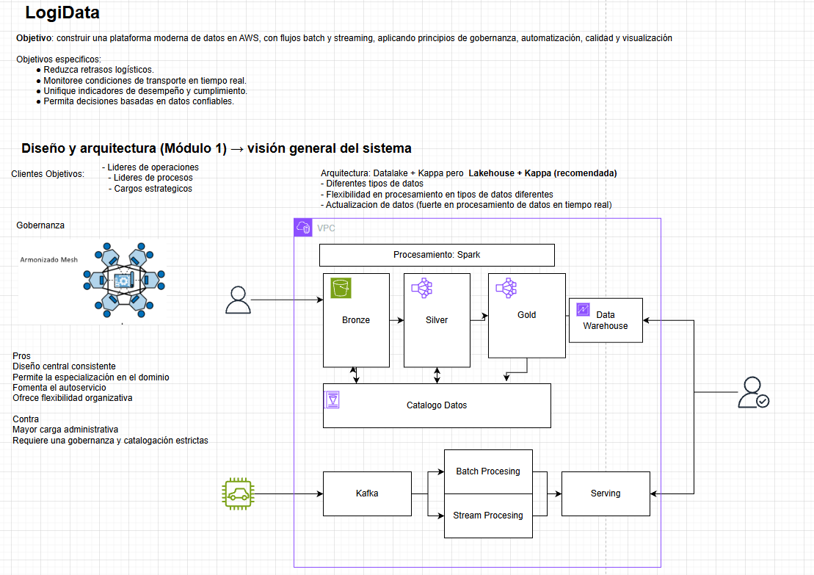

**Resumen Ejecutivo**

- **Propósito:**: Entregar una solución técnica y roadmap para el caso LogiData S.A.S. basada en los requerimientos del proyecto. Ver enunciado: [Proyecto LogiData (PDF)](modulo-07_proyecto_trasversal/Proyecto%20Transversal_%20Caso%20LogiData%20S.A.S.%20_%20Ing.%20Datos.pdf).
- **Alcance:**: Arquitectura de ingesta, procesamiento, almacenamiento y visualización; plan de implementación y criterios de validación.

**Arquitectura Propuesta**
- **Diagrama fuente:**: Arquitectura referenciada desde: https://drive.google.com/file/d/1j7MrCkzXB5QR8xuWQ9LmHPe5JSzaGBtO/view?usp=sharing

- **Resumen:**: Arquitectura de ingesta en streaming/batch, zona de landing en objeto (MinIO/S3), procesado por motor paralelo (Spark/Flume/Flink), almacenamiento analítico (ClickHouse / Trino / Postgres Timescale para series) y capa de consumo (BI / APIs).

**Componentes y responsabilidades**

- **Orígenes de datos**: sistemas transaccionales, ficheros CSV/JSON, sinks de mensajería.
- **Ingesta**: `Kafka` (streaming) y/o `Dataflow` por lotes con `Airflow` para orquestación.
- **Zona de objetos**: `MinIO` (local) o `S3` (cloud) para raw y curated.
- **Procesamiento**: `Spark` o `Flink` para ETL/streaming; transformaciones hacia modelos dimensionales y tablas de series temporales.
- **Almacenamiento analítico**: `ClickHouse` para consultas analíticas de baja latencia; `Postgres + TimescaleDB` para series temporales y datos relacionales.
- **Catálogo/metadatos**: `Hive Metastore` o `Data Catalog` ligero para esquemas y linaje.
- **Consulta federada/SQL**: `Trino` para acceso federado a datos.
- **Dashboard / APIs**: `Superset` o `Metabase` para visualización; microservicios `FastAPI` para endpoints analíticos.

**Flujo de datos (alto nivel)**

- 1) Captura: Eventos -> `Kafka` / Batch files -> landing en `MinIO`.
- 2) Validación/Enriquecimiento: Jobs Spark/Flink leen landing, validan, enriquecen y escriben en `bronze/silver/gold` en `MinIO`.
- 3) Cargas a OLAP y TSDB: Extracts desde `gold` -> `ClickHouse` / `TimescaleDB` para consultas analíticas y series.
- 4) Consumo: `Trino` y dashboards consultan `ClickHouse`/`TimescaleDB`; APIs exponen KPIs.

